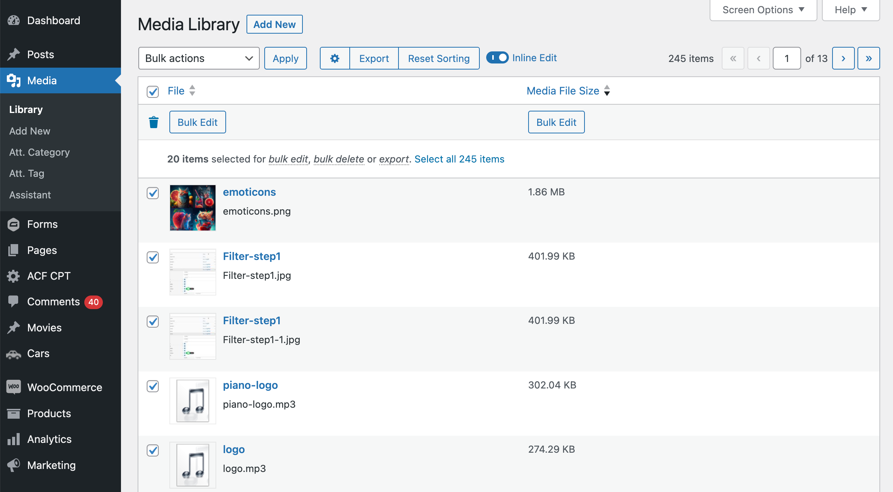

# Admin Columns - Media File Size Column

This is an extension plugin for Admin Columns Pro. It will allow you to add a "Media File Size" column to the Media list table and store the file size as metadata.
The column will display the file size of each media file. By clicking the column header "Media File Size" you will be able to sort it.

The file size will automatically be stored as metadata for each file that is added to the media library.

Follow the instruction below on how to add the column and how to update all file sizes at once.

-----------------------

## Usage
1. Go to Settings > Admin Columns > Columns (tab)
2. Select "Media" from the dropdown
3. Add the new "Media File Size" column and save the column settings
4. Now visit the media list table
5. Select all media files (using the top checkbox on the left) and then click on "select all x items".
6. Click on "Bulk Edit" in the top bar and click "Update". This will store all file sizes as metadata.
7. Refresh the page. The column will now display the file size of each media file.
8. Optional: you can now sort the column by clicking its header

## Screenshot

## Changelog
Please see `readme.txt` for changelog